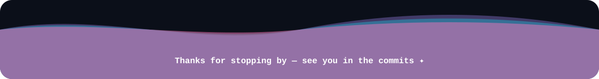

  
  
  
  

 

 

<table align="center">
  <tr>
    <td align="center" width="170"><b>🧬 Languages</b></td>
    <td></td>
  </tr>
  <tr>
    <td align="center"><b>🎨 Frontend</b></td>
    <td></td>
  </tr>
  <tr>
    <td align="center"><b>⚙️ Backend & Data</b></td>
    <td></td>
  </tr>
  <tr>
    <td align="center"><b>🚀 DevOps & Tools</b></td>
    <td></td>
  </tr>
  <tr>
    <td align="center"><b>🤖 AI & Agents</b></td>
    <td>
      
      
      
      
      
      
      
    </td>
  </tr>
</table>

  
  
  
  
  
  
  
  
  
  
  

 

  
  
  
  
  
  

 

 

<picture>
  <source media="(prefers-color-scheme: dark)" srcset="https://raw.githubusercontent.com/Wiibleyde/Wiibleyde/output/snake-dark.svg" />
  <source media="(prefers-color-scheme: light)" srcset="https://raw.githubusercontent.com/Wiibleyde/Wiibleyde/output/snake.svg" />
  
</picture>

 
 

